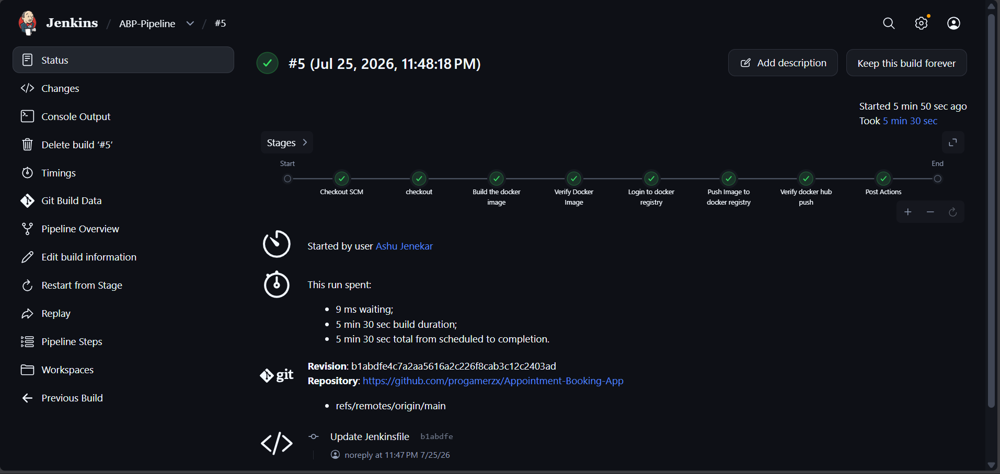
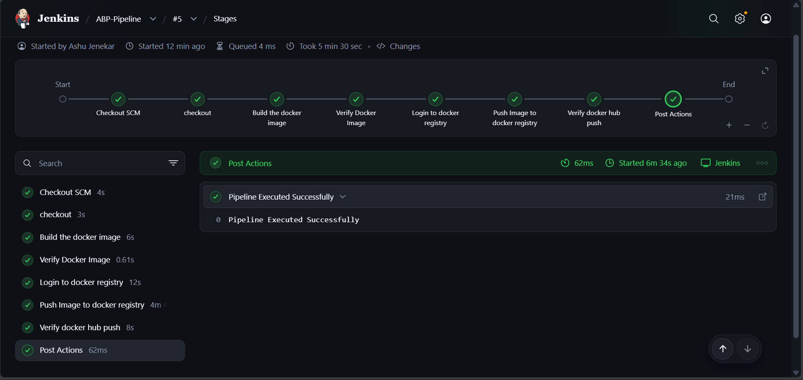

# Appointment Booking App

A Python Flask-based web application for booking and managing appointments. It uses an Azure SQL Database backend (via `pyodbc`) and is fully containerized using Docker for easy deployment to Azure App Service or any containerized environment.

## 🚀 Features
- Book, confirm, and cancel appointments
- View available services and durations
- Dashboard with live statistics and appointment lists
- Built with Python (Flask) and Azure SQL Database
- Fully containerized using Docker
- Automated CI/CD pipeline using Jenkins

## 🛠️ Tech Stack
- **Backend:** Python 3.10, Flask, Gunicorn
- **Database:** Azure SQL Database (via `pyodbc` and Microsoft ODBC Driver 18)
- **Frontend:** HTML, CSS, Jinja2 Templates
- **Containerization:** Docker
- **CI/CD:** Jenkins

---

## 💻 Local Setup (Without Docker)

1. **Clone the repository:**
   ```bash
   git clone https://github.com/progamerzx/Appointment-Booking-App.git
   cd Appointment-Booking-APP-main
   ```

2. **Create a virtual environment and install dependencies:**
   ```bash
   python -m venv venv
   source venv/bin/activate  # On Windows: venv\Scripts\activate
   pip install -r requirements.txt
   ```

3. **Configure Environment Variables:**
   Create a `.env` file in the root directory and add your Azure SQL Database credentials:
   ```env
   SQL_SERVER=your_server.database.windows.net
   SQL_DATABASE=your_database
   SQL_USER=your_username
   SQL_PASSWORD=your_password
   SQL_ENCRYPT=yes
   SQL_TRUST_CERT=no
   ```
   *(Ensure you have the Microsoft ODBC Driver 18 installed on your machine).*

4. **Run the App:**
   ```bash
   python app.py
   ```
   The app will be available at `http://localhost:8080`.

---

## 🐳 Building and Running with Docker

You can easily run the application using Docker, which automatically handles the installation of the required ODBC drivers.

1. **Build the Docker Image:**
   ```bash
   docker build -t appointment-app:latest .
   ```

2. **Run the Docker Container:**
   ```bash
   docker run -p 8080:8080 \
     -e SQL_SERVER=your_server.database.windows.net \
     -e SQL_DATABASE=your_database \
     -e SQL_USER=your_username \
     -e SQL_PASSWORD=your_password \
     appointment-app:latest
   ```

---

## ⚙️ CI/CD Pipeline (Jenkins)

This project includes a `Jenkinsfile` to automate building and pushing the Docker image to a container registry (like Docker Hub or Azure Container Registry).

### Pipeline Stages
1. **Checkout:** Pulls the latest source code from the repository.
2. **Build the Docker image:** Builds the image using the provided `Dockerfile` and tags it with the Jenkins build number (`$BUILD_NUMBER`).
3. **Verify Docker Image:** Inspects the built image locally.
4. **Login to Docker Registry:** Authenticates with the registry using Jenkins credentials (`dockercreds`).
5. **Push Image to Docker Registry:** Pushes the versioned image to the remote registry and logs out.
6. **Verify Docker Hub Push:** Pulls the image back to verify the push was successful.

### How to use the Jenkinsfile:
1. Ensure Jenkins has the **Docker Pipeline** plugin installed and Docker is available on the Jenkins agent.
2. In Jenkins, create a **Global Credential** (Username with Password) and give it the ID `dockercreds`. Enter your Docker Hub / Registry credentials.
3. Create a new Pipeline job and point it to this Git repository.
4. Run the build! The pipeline will automatically build and push the image as `ctslab/abp:<build-number>`.

### Screenshots




---

## 🚢 Deployment
For detailed deployment instructions to **Azure App Service**, please refer to the [deploy_instructions.md](deploy_instructions.md) file included in this repository.
